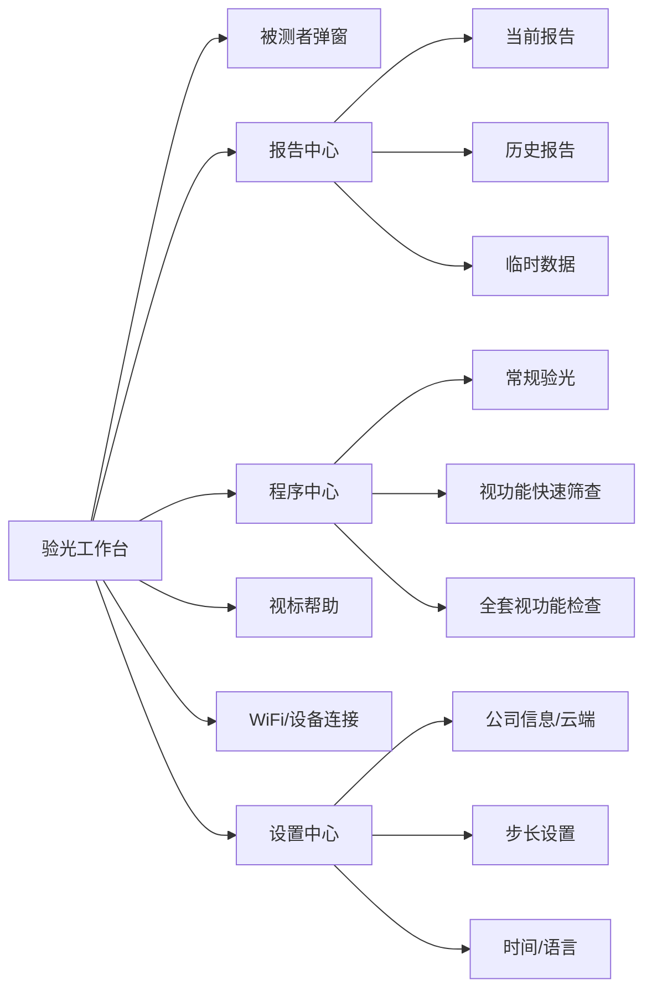

# 平板验光仪产品与交互说明

## 1. 文档目的

本文档用于把客户提供的竞品说明整理为开发可落地、设计可衔接的平板端产品文档，目标是：

- 让 Android 开发可以直接理解页面结构、状态、交互规则和数据对象。
- 让 Figma 或国产设计工具可以据此输出横屏 UI 设计稿。
- 把原始 Word 中未明确描述的交互补齐为一版可实施方案。

本文档基于以下材料整理：

- `验光仪功能说明.docx`
- `《验光仪》项目开发计划-平板端-20260329.docx`
- 原始文档内嵌截图
- `res/` 中现有竞品资源包

## 2. 产品范围与版本边界

### 2.1 本期范围

本期仅覆盖平板端横屏 App，包含以下模块：

- 验光工作台首页
- 被测者管理
- 报告中心
- 程序管理
- WiFi/设备连接
- 步长设置
- 时间与语言设置
- 公司信息与云端配置
- 本地历史/临时数据

### 2.2 明确不做

- 手机竖屏适配
- 多角色后台管理系统
- 云端平台管理端
- 打印模板编辑器
- 复杂统计分析报表

### 2.3 当前假设

- 主使用设备为 Android 平板，长期横屏使用。
- 主验光流程由验光师或门店人员操作。
- 平板与验光主设备通过 WiFi 通信，打印机/扫码枪等外设统一通过设备接入层管理。
- 如后续接入方式变化，只替换连接层，不改变页面结构。

## 3. 业务背景与核心术语

### 3.1 页面里会频繁出现的验光字段

| 字段 | 含义 | UI 表现 | 默认步进建议 |
| --- | --- | --- | --- |
| SPH | 球镜，表示近视/远视度数 | 数值格 + 旋钮调节 | 0.25 |
| CYL | 柱镜，表示散光度数 | 数值格 + 旋钮调节 | 0.25 |
| AXIS / AXS | 轴位，表示散光方向 | 数值格 + 旋钮调节 | 1 或 5 |
| ADD | 近附加光度 | 数值格 + 旋钮调节 | 0.25 |
| VA | 矫正视力 | 数值格或等级值 | 与视标联动 |
| X / Y | 棱镜直角坐标值 | 数值格 + 旋钮调节 | 0.1 或 0.5 |
| R / θ | 棱镜极坐标值 | 数值格 + 旋钮调节 | 0.1 或 0.5 |
| PD | 瞳距 | 设置页项 | 0.1 或 0.5 |

### 3.2 常见验光/视功能缩写

| 术语 | 建议中文释义 | 在系统中的用途 |
| --- | --- | --- |
| NPC | 近点集合 | 底部检查工具，记录距离与结果 |
| NPA | 近点调节 | 底部检查工具，记录距离与结果 |
| NRA | 负相对调节 | 底部检查工具，支持“模糊/恢复”记录 |
| PRA | 正相对调节 | 底部检查工具，支持“模糊/恢复”记录 |
| AC/A | 调节性集合/调节比 | 底部检查工具，支持首次/再次对齐流程 |
| AMP | 调节幅度 | 底部检查工具，区分左右眼记录 |
| BCC | 双眼交叉柱镜检查 | 程序步骤中的检查项 |
| MPMVA | 最大正镜至最佳视力 | 程序步骤中的主观验光项 |

### 3.3 术语解释策略

- 上述定义用于帮助开发理解 UI 语义，不替代医疗规范。
- 涉及具体临床判读标准时，以客户设备协议、专业人员口径或后续 SOP 为准。
- 对于 `Schober`、`Worth`、`带固视的隐斜视` 等视标，本期优先保证视标切换与显示，不在 App 内做临床解释算法。

## 4. 信息架构



## 5. 全局交互框架

## 5.1 设计基线

- 仅输出横屏。
- 设计基线建议使用 `2560 x 1600` 或等比 `1920 x 1200`。
- 最小适配建议不低于 `1280 x 800`。
- 整体布局按 16:10 横屏优先设计。

## 5.2 首页全局布局建议

工作台建议拆成 5 个稳定区域：

1. 顶部状态区
   - 当前被测者
   - 当前程序
   - 连接状态
   - 当前眼别/远近状态
   - 时间与电量
2. 左侧主操作栏
   - 被测者
   - 帮助
   - IN
   - 打印
   - SHIFT
   - 报告
   - 设备/设置快捷入口
3. 中央参数控制区
   - 数据来源切换
   - 左右眼/双眼切换
   - SPH/CYL/AXIS/VA/ADD/X/Y 数据条
   - 镜片开关
   - C- / C+ 模式
   - 棱镜坐标模式
   - 旋钮控制区
4. 右侧视标显示区
   - 当前视标
   - 视标切换入口
   - 视标方向/布局控制
5. 底部检查工具区
   - 远距/近距切换
   - 开灯/关灯
   - NPC / NPA / NRA / PRA / AC/A / AMP
   - 程序当前步骤提示

## 5.3 全局状态模型

首页必须始终维护以下状态：

- `currentSubject` 当前被测者
- `currentProgram` 当前验光程序
- `deviceConnectionState` 主设备连接状态
- `printerConnectionState` 打印机连接状态
- `distanceMode` 远距 / 近距
- `eyeMode` 左眼 / 右眼 / 双眼
- `lensDataSource` LM / AR / SubJ / Un-aided / Final
- `selectedMetric` 当前选中的调节字段
- `prismMode` 直角坐标 / 极坐标
- `cylinderSignMode` C- / C+
- `activeChartType` 当前视标
- `activeTool` 当前底部检查工具
- `unsavedChanges` 是否存在未保存报告

## 5.4 全局状态规则

- 未选择被测者时，不允许进入打印和最终报告确认。
- 未连接主设备时，`IN`、开灯、关灯、部分联动动作置灰。
- 未连接打印机时，打印按钮可点，但进入连接引导弹窗更友好。
- 当前正在执行程序步骤时，页面顶部应固定展示“步骤名 + 目标眼别 + 当前数据来源”。
- 存在未保存数据时，切换被测者、导入报告、退出首页均需二次确认。

## 6. 核心页面说明

## 6.1 验光工作台首页

### 6.1.1 页面目标

这是主工作台，承担主观验光、视标切换、设备联动、视功能检查和程序执行。

### 6.1.2 页面组成

#### A. 左侧主操作栏

| 按钮 | 功能 | 触发结果 |
| --- | --- | --- |
| 被测者 | 选择或录入当前被测者 | 打开被测者弹窗 |
| 帮助 | 查看当前视标说明 | 打开帮助弹窗 |
| IN | 将当前选中镜片或功能置入光路 | 向设备发送指令 |
| 打印 | 打印当前报告 | 打开打印确认或连接引导 |
| SHIFT | 启用步长放大/功能复用 | 修改当前调节行为 |
| 报告 | 查看当前报告 | 进入报告中心 |

补充建议：

- 左侧栏底部增加 `设备` 和 `设置` 图标入口，避免把系统级设置混入报告页。
- 对需要设备依赖的按钮展示在线/离线态。

#### B. 中央参数控制区

建议顶部是一条“验光参数总线”，按以下顺序排列：

- 数据来源：`LM / AR / SubJ / Un-aided / Final`
- 眼别：`L / R / B`
- 参数格：`SPH / CYL / AXIS / VA / ADD / X / Y`
- 镜片显示模式：`只看左镜片 / 只看右镜片 / 双镜片`
- `C- / C+`
- 棱镜模式：`X/Y` 与 `R/θ`

#### C. 右侧视标区

支持以下视标切换：

- 隐斜视
- 带固视的隐斜视
- 立体视
- 垂直重合
- Schober
- Worth
- 固视
- 红/绿
- 偏振红/绿
- VA 表
- 交叉格栅
- 散光表
- 斑点图
- 双眼平衡

#### D. 底部工具区

支持以下工具：

- 远距 / 近距切换
- 开灯
- 关灯
- NPC
- NPA
- NRA
- PRA
- AC/A
- AMP

### 6.1.3 首页关键交互规则

#### 1. 参数选中与调节

- 点击任一参数格后进入选中态，旋钮、加减按钮都作用于该字段。
- 顺时针旋转代表增加，逆时针代表减少。
- 如果启用 `SHIFT`，使用对应字段的 shift 步长。
- 参数变化时立即刷新页面显示，同时决定是否同步发送设备命令。

#### 2. 步长规则

- SPH 默认 0.25，支持 0.12。
- CYL 默认 0.25，支持 0.50。
- AXIS 默认 1 或 5。
- 棱镜默认 0.1 或 0.5。
- PD 默认 0.1 或 0.5。
- `SHIFT` 打开后读取 shift 步长配置。

#### 3. 镜片显示切换

- `双镜片` 显示左右眼同时存在。
- `仅左镜片` 只显示左镜片相关内容。
- `仅右镜片` 只显示右镜片相关内容。
- 切换时不清空另一只眼数据，只改变显示与操作焦点。

#### 4. C- / C+ 模式

- `C-` 模式下，柱镜允许为负值。
- `C+` 模式下，柱镜只允许为正值。
- 切换时如果需要做等效球镜换算，必须在产品确认后再做；本期默认仅切换输入约束，不自动改写历史数据。

#### 5. 棱镜坐标模式

- `X/Y` 模式展示水平和垂直两个数值。
- `R/θ` 模式展示总棱镜度和角度。
- 模式切换建议即时换算显示，不改动底层原始值存储结构。

#### 6. 远距 / 近距切换

- 切换后，视标区、底部工具、VA 范围、程序步骤提示联动更新。
- 近距模式下优先展示近用相关视标与视功能工具。
- 如果当前步骤仅允许远距或仅允许近距，切换需提示“当前步骤固定模式”。

#### 7. 视标切换

- 点击右侧视标分类项，右侧展示对应视标。
- 当前视标变化时，帮助内容同步变化。
- 部分视标支持横排/竖排/单字模式。
- 切换方向时不改变当前验光数据，只改变显示。

#### 8. 帮助按钮

- 必须依赖当前已选中的视标。
- 未选中视标时点击帮助，提示“请先选择视标”。
- 帮助内容优先做成本地静态说明页，不依赖网络。

#### 9. IN 按钮

- 表示把当前选中的镜片或功能置入光路。
- 无设备连接时禁用。
- 执行后要有明确反馈：成功 toast、失败 toast、超时 toast。

#### 10. 打印按钮

- 若存在当前报告，则进入打印预览/确认。
- 若无打印机连接，则先进入打印机连接页或连接弹窗。
- 若无当前报告，则提示“请先完成验光或进入报告页”。

### 6.1.4 底部工具交互规则

#### NPC / NPA

- 输入值必须大于 0。
- 加减步进为 1。
- 支持距离输入后自动计算结果值。
- 建议保留“结果确认”按钮，避免边改边覆盖。

#### NRA / PRA

- NRA 值应大于 0。
- PRA 值应小于 0。
- 步进为 0.25。
- 均支持“模糊”与“恢复”两个记录点。
- 页面需展示当前值、模糊值、恢复值三组结果。

#### AC/A

- BI 调整步进为 0.5。
- 存在“首次对齐”和“再次对齐”两个阶段。
- 页面要记录两个阶段的输入值和对齐结果。

#### AMP

- 可按 `RAMP / LAMP` 或左右眼切换。
- 步进为 1。
- 页面要明确当前记录眼别，并支持左右独立保存。

## 6.2 被测者管理

### 6.2.1 页面目标

完成当前验光会话的被测者绑定、录入、检索和扫码导入。

### 6.2.2 字段建议

- 姓名
- 电话
- 性别
- 出生日期
- 地址
- 备注
- 编号或二维码内容

### 6.2.3 交互规则

- 支持“新建”和“检索”两个页签。
- 检索至少支持姓名、手机号。
- 扫码录入建议支持相机扫码和外接扫码枪。
- 选中某个被测者后，首页顶部立即刷新当前会话对象。
- 若当前会话已有未保存数据，切换被测者时必须确认。

## 6.3 报告中心

### 6.3.1 页面目标

查看、保存、打印、导入、分享当前验光结果。

### 6.3.2 一级结构

- 当前报告
- 历史报告
- 临时数据

### 6.3.3 当前报告的三个页签

- 视力
- 视功能
- 处方

### 6.3.4 报告页操作

| 操作 | 建议实现 |
| --- | --- |
| 打印 | 进入打印确认，支持已接入打印设备 |
| 保存到本地 | 保存为结构化数据，便于二次导入 |
| 导入报告 | 从本地文件导入并回填到当前会话 |
| 生成二维码 | 生成分享码或报告访问码 |
| 设置 | 打开公司名称和云端配置弹窗 |
| 历史记录 | 查看历史报告和临时数据 |

### 6.3.5 报告数据规则

- 报告始终与被测者绑定。
- 报告分“草稿”和“最终版”两种状态。
- 首页修改数据后，报告页实时反映，但在最终确认前不覆盖历史最终版。
- 导入报告时，允许选择“覆盖当前会话”或“作为参考数据导入”。

## 6.4 程序中心

### 6.4.1 页面目标

把验光步骤配置成可执行流程，并在首页驱动步骤进行。

### 6.4.2 程序类型

| 程序 | 说明 |
| --- | --- |
| 常规验光 | 标准主观验光流程 |
| 视功能快速筛查 | 轻量视功能检查流程 |
| 全套视功能检查 | 完整双眼视功能检查流程 |

### 6.4.3 程序模板字段建议

每一个步骤建议至少包含：

- `stepId`
- `stepName`
- `programType`
- `distanceMode`
- `eyeMode`
- `lensDataSource`
- `activeField`
- `importData`
- `fogValue`
- `nearLampEnabled`
- `visualFunctionType`
- `skipField`
- `skipOperator`
- `skipValue`
- `sortIndex`
- `enabled`

### 6.4.4 常规验光推荐步骤

1. 雾视
2. 去雾视（右眼）
3. 粗调散光轴位（右眼）
4. 粗调散光度数（右眼）
5. 首次 MPMVA（右眼）
6. 首次红绿检测（右眼）
7. 精调散光轴位（右眼）
8. 精调散光度数（右眼）
9. 二次红绿检测（右眼）
10. 单眼 MPMVA（右眼）
11. 去雾视（左眼）
12. 粗调散光轴位（左眼）
13. 粗调散光度数（左眼）
14. 首次 MPMVA（左眼）
15. 首次红绿检测（左眼）
16. 精调散光轴位（左眼）
17. 精调散光度数（左眼）
18. 二次红绿检测（左眼）
19. 单眼 MPMVA（左眼）
20. 双眼最佳视力检测
21. 双眼平衡测试
22. 双眼 MPMVA
23. 试戴

### 6.4.5 视功能快速筛查推荐步骤

1. 双眼融合测试
2. NRA
3. PRA
4. 远眼位
5. 近眼位

### 6.4.6 全套视功能检查推荐步骤

1. 双眼融合测试
2. 立体视测试
3. 远眼位
4. 近眼位
5. AC/A（梯度法）
6. NRA
7. BCC 检查
8. PRA
9. AMP 检查
10. 远距水平融像
11. 近距水平融像

### 6.4.7 程序执行规则

- 首页左下角持续显示当前选中程序。
- 开始程序后，首页顶部或底部要出现步骤条。
- 每步完成后支持“下一步”“跳过”“返回上一步”。
- 当步骤配置了跳过条件时，系统自动判断是否跳过，并记录跳过原因。
- 程序执行中切换被测者、导入报告、切换程序都需要二次确认。

## 6.5 WiFi/设备连接

### 6.5.1 连接对象

- 主验光设备
- 打印机
- 扫码枪或其他外设

### 6.5.2 页面功能

- 搜索设备
- 展示已连接设备
- 连接/断开
- 最近连接记录
- 连接日志

### 6.5.3 交互规则

- 主设备与打印机应分组展示。
- 已连接设备需要在首页顶部同步状态。
- 断开后依赖该设备的按钮立刻降级。
- 搜索中要有 loading 状态。

## 6.6 步长设置

### 6.6.1 页面目标

允许用户调整常用字段的普通步长和 SHIFT 步长。

### 6.6.2 建议项

| 字段 | 普通步长 | SHIFT 步长 |
| --- | --- | --- |
| SPH | 0.12 / 0.25 | 0.50 / 1.00 / 3.00 |
| CYL | 0.25 / 0.50 | 1.00 / 2.00 / 3.00 |
| AXIS | 1 / 5 | 15 / 30 |
| Prism | 0.1 / 0.5 | 1.0 / 2.0 / 3.0 |
| PD | 0.1 / 0.5 | 1.0 / 2.0 / 3.0 / 5.0 |

### 6.6.3 交互规则

- 使用加减号调整，不允许随意输入非法值。
- 支持一键恢复默认值。
- 修改后立即生效，并持久化到本地。

## 6.7 时间与语言

### 6.7.1 配置项

- 语言：中文 / English
- 显示持续时间：显示 / 隐藏
- 日期单位：年 / 月 / 日
- 时间单位：时 / 分 / 秒

### 6.7.2 交互规则

- 语言切换后需提示是否立即生效。
- 关键业务字段不建议跟随本地化做临床含义变化，只翻译 UI 文案。

## 6.8 公司信息与云端配置

### 6.8.1 配置项

- 公司名称
- 数据上传云端开关
- 云端地址
- 云端账号
- 云端密码

### 6.8.2 交互规则

- 当上传开关关闭时，云端相关字段置灰。
- 地址应校验格式。
- 密码支持显示/隐藏。
- 保存前进行必填项校验。

## 7. 关键数据对象建议

## 7.1 被测者

```json
{
  "subjectId": "string",
  "name": "string",
  "phone": "string",
  "gender": "male | female | unknown",
  "birthDate": "yyyy-MM-dd",
  "address": "string",
  "remark": "string",
  "qrCodeValue": "string"
}
```

## 7.2 验光会话

```json
{
  "sessionId": "string",
  "subjectId": "string",
  "programId": "string",
  "distanceMode": "far | near",
  "eyeMode": "left | right | both",
  "activeChartType": "string",
  "status": "draft | completed | archived",
  "createdAt": "timestamp",
  "updatedAt": "timestamp"
}
```

## 7.3 单眼验光数据

```json
{
  "eye": "left | right",
  "source": "LM | AR | SubJ | Un-aided | Final",
  "sph": 0,
  "cyl": 0,
  "axis": 0,
  "add": 0,
  "va": "string",
  "prismX": 0,
  "prismY": 0,
  "prismR": 0,
  "prismTheta": 0
}
```

## 7.4 视功能记录

```json
{
  "toolType": "NPC | NPA | NRA | PRA | AC/A | AMP | BCC",
  "eye": "left | right | both",
  "distanceMode": "far | near",
  "currentValue": "string",
  "blurValue": "string",
  "recoveryValue": "string",
  "extra": {}
}
```

## 7.5 程序步骤

```json
{
  "stepId": "string",
  "programType": "regular | quick_visual_function | full_visual_function",
  "stepName": "string",
  "distanceMode": "far | near",
  "eyeMode": "left | right | both",
  "lensDataSource": "LM | AR | SubJ | Un-aided | Final",
  "activeField": "SPH | CYL | AXIS | VA | ADD | X | Y",
  "importData": true,
  "fogValue": "+0.25",
  "nearLampEnabled": false,
  "visualFunctionType": "NPC",
  "skipCondition": {
    "field": "SPH",
    "operator": ">=",
    "value": "0.50"
  },
  "sortIndex": 1,
  "enabled": true
}
```

## 8. 页面级异常与空状态

### 8.1 空状态

- 未选中被测者
- 无历史报告
- 无临时数据
- 无可用设备
- 无当前程序

### 8.2 异常状态

- 设备连接失败
- 设备命令超时
- 打印失败
- 导入文件格式错误
- 保存失败
- 云端配置不完整

### 8.3 提示方式建议

- 成功：轻提示 toast
- 失败：红色 toast + 可重试操作
- 关键中断：弹窗
- 程序步骤异常：顶部条内联提示

## 9. 需要客户尽快确认的事项

以下内容原始材料存在冲突或描述不完整，建议你在开发前尽快确认：

1. 主验光设备与外设的最终接入方式和发现机制。
2. `SHIFT` 是纯步长放大，还是还承担镜片组切换。
3. `C- / C+` 切换时，是否要自动做处方等效换算。
4. 报告本地保存格式是 JSON、PDF，还是厂商私有格式。
5. 二维码展示的是完整报告、短链接，还是摘要码。
6. 程序步骤是否允许用户自行增删改排序。
7. 视标帮助内容是否全部内置，还是后续需要后台维护。
8. 云端上传是真实一期需求，还是仅预留。
9. 打印是否需要分页预览和模板切换。

## 10. 本文档对应的参考截图

关键截图已整理到：

- `docs/assets/reference/`
- 详细索引见 `03_参考截图索引.md`
